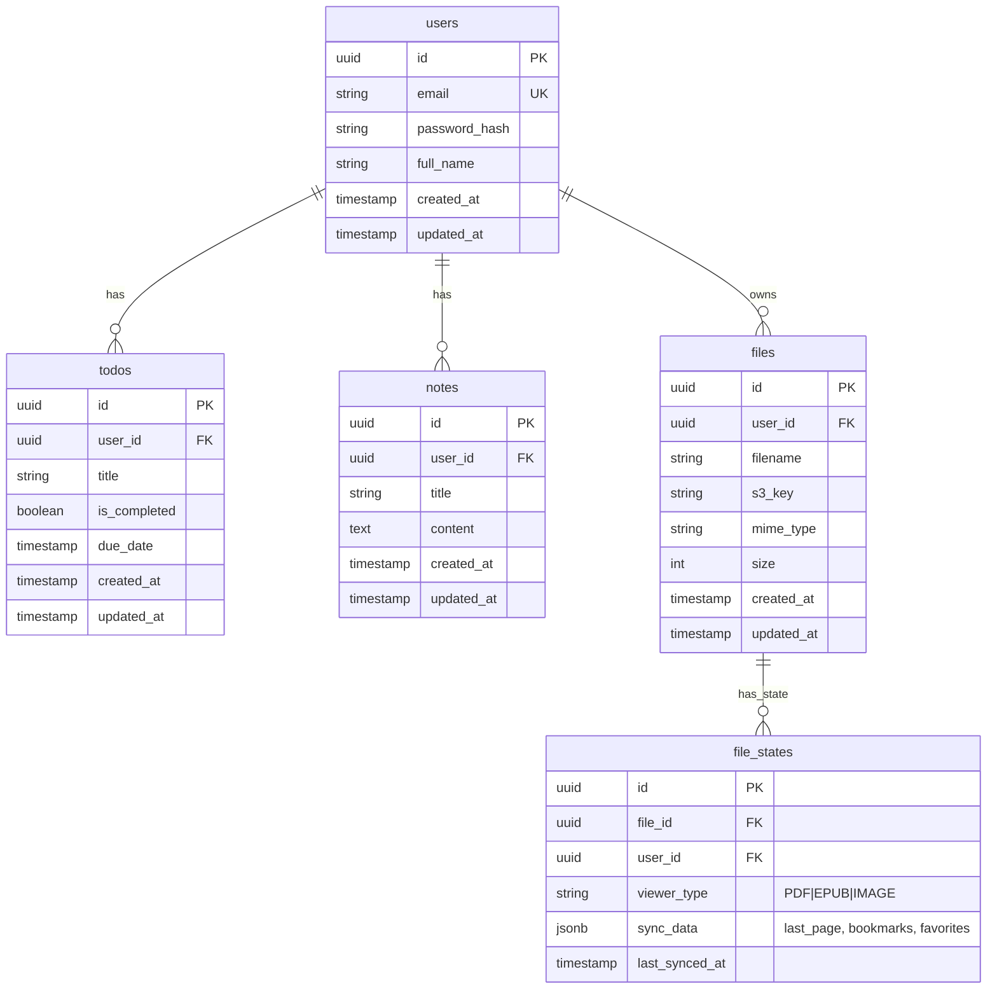

# Database Schema Design

The system uses a relational database (PostgreSQL) to ensure data integrity and complex querying capabilities. Below is the high-level schema design.

## Entities Relationship Diagram (ERD)

## Schema Details

### 1. Identity Domain (Users)
- **Table**: `users`
- **Purpose**: Stores user credentials and profile info.
- **Indexes**: `email` (Unique).

### 2. Productivity Domain (Todos & Notes)
- **Table**: `todos`
    - Stores task items.
    - **Fields**: `is_completed` (boolean), `due_date` (nullable).
- **Table**: `notes`
    - Stores rich text notes.
    - **Fields**: `content` (Text/Markdown).

### 3. Library Domain (Files & Sync)
- **Table**: `files`
    - Metadata for uploaded files (PDFs, EPUBs, Images).
    - Actual content stored in Object Storage; `s3_key` references it.
- **Table**: `file_states` (Synchronization)
    - Stores the "state" of a file for a user across devices.
    - **viewer_type**: Discriminator for the type of state (e.g., PDF viewer, Image viewer).
    - **sync_data**: JSONB column to store flexible state:
        - **PDF/EPUB**: `{ "lastPage": 5, "bookmarks": [1, 10, 25] }`
        - **Image**: `{ "isFavorite": true, "rotation": 90 }`
    - **Local-First Sync**: This table is updated via the `/v1/sync` endpoint, resolving conflicts based on `last_synced_at` or Vector Clocks if needed.

## Migrations
Database schema changes are managed via migration scripts (e.g., Flyway or Prisma Migrate) to ensuring consistency across environments.
