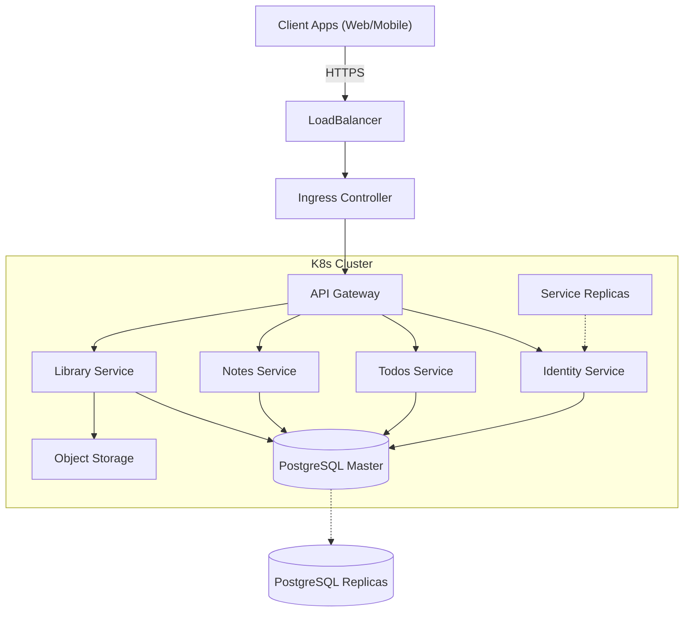

# Infrastructure & High Availability

## High Availability Deployment (Kubernetes)

The ExampleApp is designed to be deployed on a Kubernetes (K8s) cluster to ensure High Availability (HA), scalability, and resilience.

### Architecture Overview

### Components

1.  **Ingress Controller**: Use NGINX or Traefik to handle incoming traffic, SSL termination, and routing to the API Gateway.
2.  **API Gateway**: A unified entry point (using the Gateway Pattern) that routes requests to specific microservices:
    - `/v1/auth`, `/v1/users` -> Identity Service
    - `/v1/todos` -> Todos Service
    - `/v1/notes` -> Notes Service
    - `/v1/files`, `/v1/sync` -> Library Service
3.  **Microservices**:
    - **Identity Service**: Handles authentication (JWT), user management.
    - **Todos Service**: CRUD for Tasks.
    - **Notes Service**: CRUD for Notes.
    - **Library Service**: Handles File uploads, Sync logic, Viewers state (PDF/EPUB/Image).
    - All services are stateless, allowing horizontal scaling (HPA).
4.  **Database Cluster**:
    - **PostgreSQL** in HA mode (e.g., using Patroni or Stolon).
    - Primary-Replica setup for read/write splitting.
    - **Redis** for caching and session management (if needed), also for AsyncAPI message deduplication or temporary state.
5.  **Object Storage**:
    - S3-compatible storage (AWS S3, MinIO, or Google Cloud Storage) for storing Library files (PDFs, EPUBs, Images).

### Scalability Strategy

-   **Horizontal Pod Autoscaler (HPA)**: Automatically scales the number of pods for each microservice based on CPU/Memory usage.
-   **Database**: Connection pooling (PgBouncer) and Read Replicas.
-   **CDN**: Serve static assets and public files (if applicable) through a CDN.

### CI/CD Pipeline

-   **Source**: GitHub.
-   **Build**: Docker images built and pushed to Container Registry (ECR/GCR/Docker Hub).
-   **Deploy**: Helm Charts or Kustomize applied to the K8s cluster via ArgoCD (GitOps).
