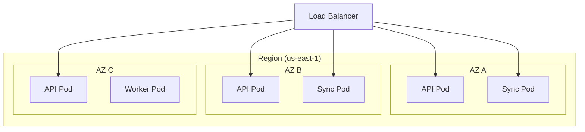

# Deployment: High Availability Kubernetes

We deploy the solution on a Kubernetes (K8s) Cluster designed for 99.99% uptime.

## Cluster Topology

We utilize a **Multi-AZ (Availability Zone)** strategy.

## Workloads

### 1. `xeo-api` Deployment
*   **Replicas**: Minimum 3 (one per AZ).
*   **HPA (Horizontal Pod Autoscaler)**: Scales based on CPU usage (target 70%) and Request Latency.
*   **Probes**: Liveness and Readiness endpoints `/healthz`.

### 2. `xeo-sync` StatefulSet/Deployment
*   **Why**: Websockets are stateful (long-lived connections).
*   **Sticky Sessions**: Configured at the Ingress Controller level to ensure reconnection attempts hit the same node if needed (though Redis Adapter alleviates strict requirement).
*   **Scaling**: Scales based on *Active Connection Count*.

### 3. `xeo-worker` Deployment
*   **Purpose**: Background tasks like Thumbail generation for uploaded PDFs/Images.
*   **Scaling**: KEDA (Kubernetes Event-driven Autoscaling) based on Queue Depth (SQS/Redis List).

## Storage Strategy

*   **Stateful Services (DB/Redis)**: We prefer Managed Services (RDS/ElastiCache) over hosting persistent data inside K8s (StatefulSets) for production reliability.
*   **Ephemeral Storage**: Pods use ephemeral local storage for temporary file processing before upload to S3.

## Deployment Pipeline (GitOps)

We follow GitOps principles using **ArgoCD**.
1.  **Code Commit**: Developer pushes to `main`.
2.  **CI (GitHub Actions)**: Runs tests, builds Docker image, pushes to ECR.
3.  **Update Manifest**: CI updates the `helm-charts/values.yaml` with the new image tag.
4.  **ArgoCD Sync**: Detects change in git repo and applies new configuration to the K8s cluster (Canary rollout).
