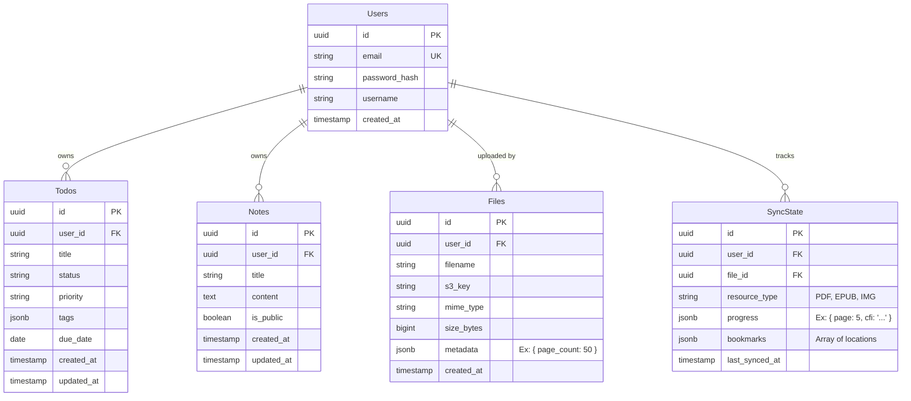

# Database Schema Design

This document outlines the relational schema used by the **Core API** and the **Sync Service**. We utilize **PostgreSQL** for its reliability, JSONB support for flexible metadata, and robust transactional integrity.

## Entity Relationship Diagram

## Table Definitions

### 1. Users
Central identity table.
*   `id`: UUID v4 primary key.
*   `settings`: JSONB column for storing UI preferences (theme, language) without needing a separate table.

### 2. Todos
Task management entities.
*   `status`: ENUM (`pending`, `in_progress`, `completed`, `archived`).
*   `tags`: Stored as a JSONB array for efficient indexing and searching (GAT indices).
*   **Indices**: Composite index on `(user_id, status)` for fast dashboard filtering.

### 3. Notes
Markdown content storage.
*   `content`: Text field. Supports full-text search via `tsvector`.
*   `is_public`: Boolean flag allowing simple sharing capabilities.

### 4. Files (Library)
Metadata for binary assets stored in Object Storage.
*   Crucially separates the *metadata* (searchable, syncable) from the *blob* (S3).
*   `metadata`: Extensible JSONB field.
    *   For PDFs: Stores `page_count`, `author`.
    *   For Images: Stores `dimensions`, `exif`.

### 5. SyncState & Viewer Data
This table powers the **Cross-Device Synchronization** for the viewers.
*   Instead of mutating the `Files` table, we track user-specific progress here.
*   **Conflict Resolution**: Columns like `version` or `last_write_timestamp` (not shown in simple diagram) are used to implement Last-Write-Wins (LWW) strategies.
*   `progress`: Flexible structure.
    *   PDF: `{"page": 42, "x": 0, "y": 100}`
    *   EPUB: `{"cfi": "epubcfi(/6/4[chap1ref]!/4/2/1:0)"}`
