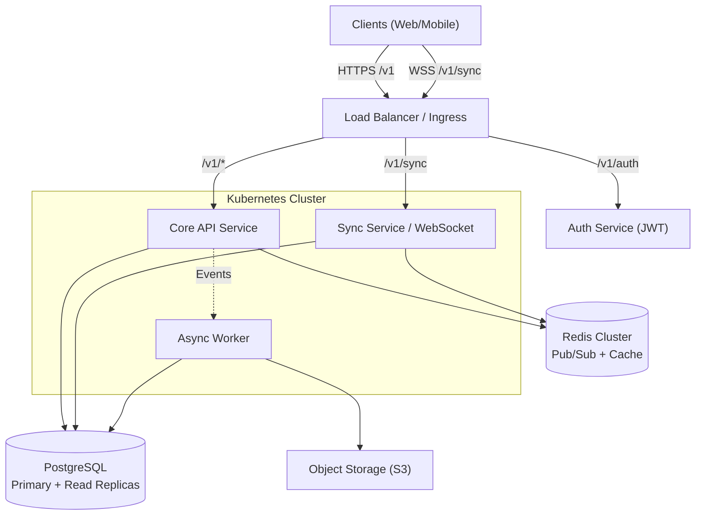

# Architecture Overview

## Introduction

The **XeoContext Application** is designed as a modern, high-performance platform integrating a traditional **RESTful API** for structured data management (Todos, Notes) with a sophisticated **Real-Time Synchronization Engine** for a "Local-First" digital library experience.

Our architecture prioritizes data integrity, low-latency interactions, and offline-first capabilities, ensuring users have a seamless experience whether they are connected to a high-speed backbone or in a disconnected environment.

## High-Level Architecture

The system is composed of two primary subsystems:
1.  **Core Application Services**: Handles identity, business logic for Todos/Notes, and standard CRUD operations via REST.
2.  **Sync & Media Services**: Manages the persistent WebSocket connections for the Library state, Viewer synchronization (PDF/EPUB progress), and file asset delivery.

## Core Components

### 1. Client Layer
*   **Single Page Application (SPA)** built with React/Next.js.
*   **Local Database (RxDB / SQLite WASM)**: Stores the full state of Todos, Notes, and Library metadata on the client device for offline access.
*   **Sync Agent**: A background worker in the client that handles the WebSocket negotiation and conflict resolution logic.

### 2. API Gateway & Ingress
*   Handles SSL termination.
*   Routes traffic between the REST API and the WebSocket Sync Service.
*   Rate limiting and basic WAF protection.

### 3. Core API Service (REST)
*   **Stack**: Node.js/Go.
*   **Responsibility**: Source of truth for User data, Todos, and Notes.
*   **Pattern**: Stateless REST API following OpenAPI 3.0 standards.

### 4. Synchronization Service
*   **Stack**: Node.js (Socket.io/uWebSockets) or Go.
*   **Responsibility**: Maintains active WebSocket connections.
*   **Scalability**: Uses Redis Adapter for broadcasting events across multiple pod replicas.

### 5. Data Persistence
*   **PostgreSQL**: Relational data (Users, Tasks, pointers to files).
*   **Object Storage (S3)**: Actual PDF, EPUB, and Image binary files.
*   **Redis**: Hot cache for user sessions and rapid sync message distribution.
