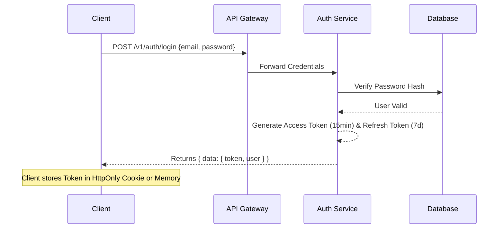
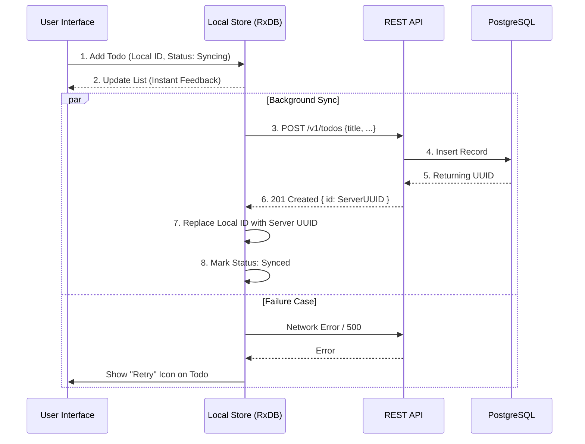
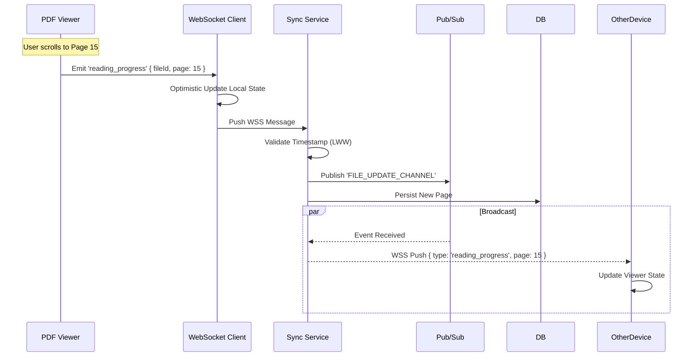

# API & Workflows

## 1. Authentication Flow
We use standard JWT (JSON Web Token) authentication.

## 2. Todo Creation (Optimistic UI)
To ensure the app feels instant, the client updates the UI *before* the server confirms the action.

## 3. Library Synchronization Workflow
The core of the "Local-First" Library experience.

